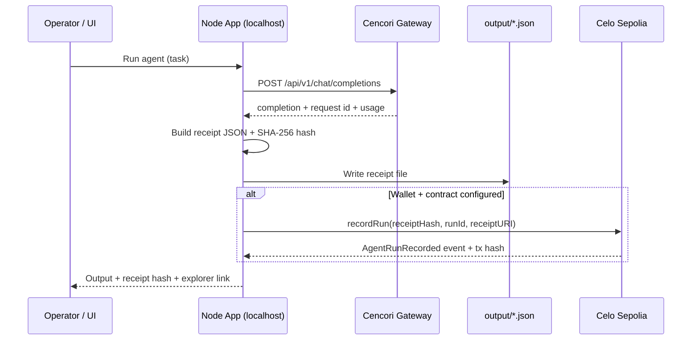

# Cencori × Celo Integration — Internal Brief for the Celo Team

| Field | Value |
|-------|--------|
| **Audience** | Celo Foundation / ecosystem engineering & partnerships |
| **From** | Cencori integrations team |
| **Status** | Working reference implementation (May 2026) |
| **Repository** | Cencori × Celo Agent Receipt Starter |
| **Testnet** | Celo Sepolia (`chainId: 11142220`) |

---

## 1. Executive summary

We built a **reference integration** that shows how production AI agents can combine:

- **Cencori** — LLM gateway, request tracing, budgets, and security controls for agent workloads.
- **Celo** — low-cost settlement layer and an onchain **proof surface** for agent runs (receipt hashes anchored via events).

The demo agent runs a **configurable task** (default in `agent.config.json`), produces a **structured JSON receipt**, hashes it deterministically, and optionally emits an onchain **`AgentRunRecorded`** event on Celo Sepolia. This is intentionally scoped as a **receipt-and-proof** story, not a full stablecoin payout pipeline.

**One-line pattern:**

```text
Cencori Agent Run → Structured Receipt → SHA-256 Hash → recordRun() on Celo Sepolia
```

This gives Celo builders a forkable starter and gives both teams a concrete artifact for hackathons, docs, and co-marketing around *agents that can safely move money*.

---

## 2. Why this matters for Celo

| Celo strength | How this integration uses it |
|---------------|------------------------------|
| Mobile-first, stablecoin-native economy | Receipt metadata models USDC-style payments; extension path to real transfers |
| Low-cost L2 on Sepolia | Cheap `recordRun` events for audit / reputation |
| Agent & identity narratives (ERC-8004, MiniPay) | Receipt hash + `externalRunId` are natural inputs for reputation registries |
| Developer testnet (Sepolia) | Full flow tested on chain `11142220` with public RPC + Blockscout |

Cencori covers **what happened in the AI layer** (model, cost, trace ID, controls). Celo covers **what can be proven onchain** (hash, run ID, recorder, URI pointer) without storing full model output onchain.

---

## 3. Architecture



### 3.1 Components

| Layer | Responsibility |
|-------|----------------|
| **Web UI** (`public/`) | Run agent, view status, browse past runs, deploy contract |
| **API server** (`src/server.mjs`) | Serves UI; keeps secrets server-side |
| **Agent runner** (`src/run-agent.mjs`) | Orchestrates Cencori call → receipt → optional Celo tx |
| **Cencori client** (`src/cencori-agent.mjs`) | OpenAI-compatible chat completions via gateway |
| **Receipt module** (`src/receipt.mjs`) | Canonical JSON + deterministic hash |
| **Celo recorder** (`src/celo-record.mjs`) | `recordRun` via viem |
| **Contract** (`contracts/AgentRunReceipts.sol`) | Event-only proof contract |

---

## 4. What is in scope vs out of scope

### In scope (shipped)

- Cencori gateway integration (chat completions, trace header, usage metadata).
- Structured agent run receipt (`cencori.agent_run_receipt` v0.1).
- Deterministic receipt hashing (sorted-key JSON → SHA-256).
- Celo Sepolia `recordRun` transaction and explorer link.
- CLI (`npm run demo`, `ship`, `deploy`) and local web UI (`npm run dev`).
- Simulation mode when API keys or Celo config are missing.
- Demo payment fields in receipt JSON (metadata only).

### Out of scope (explicitly not in this repo)

- Onchain USDC / USDT / cUSD transfers.
- x402 payment flows.
- MiniPay UI or wallet connectors.
- ERC-8004 registration (documented as extension).
- Multi-tenant auth / production deployment hardening.
- Storing full agent output onchain (only hash + URI pointer).

---

## 5. Cencori integration details

### 5.1 API endpoint

Production gateway base URL:

```text
Base URL:  https://cencori.com/api/v1
Endpoint:  POST /chat/completions
```

Use this URL in `CENCORI_BASE_URL`. Older docs referenced a separate `api.` subdomain; that host is not required for this integration.

Environment variable:

```bash
CENCORI_BASE_URL=https://cencori.com/api/v1
CENCORI_API_KEY=csk_...          # Project key from Cencori dashboard
CENCORI_AGENT_ID=                 # Optional: dashboard agent UUID
CENCORI_MODEL=llama-3.3-70b-versatile
```

### 5.2 Request shape

- OpenAI-compatible `messages` + `model`.
- `Authorization: Bearer <CENCORI_API_KEY>`.
- Optional `X-Agent-ID` when `CENCORI_AGENT_ID` is set.
- `X-Cencori-Trace-ID: <externalRunId>` for cross-system correlation with Celo `externalRunId`.

### 5.3 Controls captured in receipt

| Field | Purpose |
|-------|---------|
| `cencori_request_id` | Gateway request id (from response headers) |
| `cencori_response_simulated` | `true` if no API key (offline demo) |
| `max_spend_usd` | Budget metadata for demos |
| `shadow_mode` | Policy flag (set `false` in current research agent) |
| `approval_required` | Policy flag for future approval gates |

---

## 6. Celo integration details

### 6.1 Network

| Parameter | Value |
|-----------|--------|
| Network | Celo Sepolia |
| Chain ID | `11142220` |
| RPC | `https://forno.celo-sepolia.celo-testnet.org` |
| Explorer | `https://celo-sepolia.blockscout.com` |
| Faucet | `https://faucet.celo.org/celo-sepolia` |

### 6.2 Smart contract: `AgentRunReceipts`

Minimal proof contract — **no token logic**, no storage of receipt bodies.

```solidity
event AgentRunRecorded(
    bytes32 indexed receiptHash,
    string indexed externalRunId,
    address indexed recorder,
    string receiptURI
);

function recordRun(bytes32 receiptHash, string calldata externalRunId, string calldata receiptURI) external;
```

- **`receiptHash`**: SHA-256 of canonical receipt JSON (see §7).
- **`externalRunId`**: App-generated id, e.g. `cencori-celo-<timestamp>`.
- **`receiptURI`**: Pointer to offchain receipt (today: `file://` path; production should use HTTPS/IPFS/Arweave).
- **`recorder`**: `msg.sender` (deployer wallet).

### 6.3 Environment variables

```bash
CELO_RPC_URL=https://forno.celo-sepolia.celo-testnet.org
CELO_PRIVATE_KEY=0x...              # Hot wallet for recordRun txs
CELO_RECEIPTS_CONTRACT=0x...         # Deployed AgentRunReceipts
CELO_EXPLORER_URL=https://celo-sepolia.blockscout.com
```

### 6.4 Deploy steps (for Celo engineers)

```bash
npm install
npm run setup:celo    # creates wallet in .env if missing; prints faucet link
# Fund wallet via faucet
npm run compile       # solc → build/
npm run deploy        # writes CELO_RECEIPTS_CONTRACT to .env
npm run demo          # or npm run dev for UI
```

---

## 7. Receipt schema (v0.1)

**Type:** `cencori.agent_run_receipt`  
**Version:** `0.1`

Example (abbreviated):

```json
{
  "type": "cencori.agent_run_receipt",
  "version": "0.1",
  "network": "celo-sepolia",
  "receipt_hash": "0x757ee796756033030fa7c7ac35319e78e286348705433ad45826fe3214adc800",
  "agent": {
    "cencori_agent_id": null,
    "name": "Cencori project agent",
    "model": "llama-3.3-70b-versatile"
  },
  "run": {
    "external_run_id": "cencori-celo-1779450667190",
    "task": "...",
    "status": "completed",
    "started_at": "2026-05-22T11:51:07.190Z",
    "completed_at": "2026-05-22T11:51:09.692Z",
    "output_preview": "..."
  },
  "usage": {
    "prompt_tokens": 175,
    "completion_tokens": 457,
    "total_tokens": 632,
    "estimated_cost_usd": "0.00"
  },
  "controls": {
    "shadow_mode": false,
    "approval_required": false,
    "max_spend_usd": "0.10",
    "cencori_request_id": "8d029a95-68fe-4d69-8df3-8b245d222bd4",
    "cencori_response_simulated": false
  },
  "celo": {
    "chain_id": 11142220,
    "payment_token": "USDC",
    "payment_amount": "0.05",
    "payee": "",
    "payment_settled_onchain": false,
    "payment_note": "payment_* fields are receipt metadata only; onchain tx is recordRun(receiptHash), not a token transfer"
  },
  "onchain_recorded": false,
  "onchain_tx_hash": null
}
```

### 7.1 Hashing algorithm

1. Serialize receipt object with **sorted keys** (recursive stable JSON).
2. SHA-256 the UTF-8 string.
3. Prefix with `0x` → `receipt_hash`.

Verifiers can recompute the hash from the JSON file without trusting the app server.

---

## 8. Operator interfaces

### 8.1 CLI

| Command | Description |
|---------|-------------|
| `npm run dev` | Web UI + API at `http://localhost:3333` |
| `npm run demo` | Single agent run (CLI output) |
| `npm run ship` | Wallet check → deploy (if funded) → agent run |
| `npm run setup:celo` | Ensure `CELO_PRIVATE_KEY`, show faucet |
| `npm run deploy` | Deploy `AgentRunReceipts` to Sepolia |

### 8.2 HTTP API (local server)

| Method | Path | Description |
|--------|------|-------------|
| `GET` | `/api/config` | Default task / name / systemPrompt from `agent.config.json` |
| `GET` | `/api/status` | Cencori + wallet + contract status |
| `GET` | `/api/runs` | List recent receipt files |
| `GET` | `/api/runs/:id` | Full receipt JSON |
| `POST` | `/api/run` | Body: `{ "task": "..." }` — run agent |
| `POST` | `/api/deploy` | Deploy receipt contract |

All secrets remain in server `.env`; the browser never receives `CENCORI_API_KEY` or `CELO_PRIVATE_KEY`.

---

## 9. Security and deployment notes

| Topic | Current behavior | Recommendation for production |
|-------|------------------|-------------------------------|
| API keys | Server-side `.env` only | Secret manager; rotate keys |
| Celo private key | Single hot wallet in `.env` | Per-agent smart account or KMS; separate deploy vs runtime keys |
| Web UI auth | None (localhost assumed) | Bearer token or SSO before any public deploy |
| `receiptURI` | `file://` local path | HTTPS, IPFS, or encrypted object store |
| Payment fields | Metadata only | Wire to real transfer flow when ready |

---

## 10. Extension roadmap (for joint Celo × Cencori work)

Priority extensions we recommend discussing with the Celo team:

1. **Real stablecoin settlement** — After receipt finalization, trigger cUSD/USDC transfer on Celo when `approval_required` is false and budget allows.
2. **Public receipt storage** — IPFS/HTTPS URIs so `receiptURI` is verifiable by third parties.
3. **ERC-8004** — Map `receipt_hash` + `external_run_id` to agent identity / reputation scores.
4. **MiniPay** — Human-in-the-loop approval for agent-initiated sends.
5. **x402** — Paid tool calls with receipt line items per tool invocation.
6. **Template publish** — Public `create-cencori-celo-agent` repo for hackathon participants.

---

## 11. Demo script (for live walkthrough)

1. Open `http://localhost:3333` after `npm run dev`.
2. Show **System** panel: Cencori connected, model name, wallet balance, contract status.
3. Run agent with default task from `agent.config.json` (or custom prompt in UI).
4. Show output brief + **receipt hash** in UI.
5. If wallet funded and contract deployed: show Blockscout tx link for `AgentRunRecorded`.
6. Clarify: **payment amount in receipt ≠ onchain transfer** in this version.

Talking points for Celo audience:

- *“Every agent run gets a hash you can anchor on Celo for pennies.”*
- *“Cencori holds the AI audit trail; Celo holds the tamper-evident commitment.”*
- *“Same pattern scales to payouts, remittance agents, and ERC-8004 reputation.”*

---

## 12. Troubleshooting

| Symptom | Likely cause | Fix |
|---------|--------------|-----|
| `fetch failed` / `ECONNREFUSED` to Cencori | Wrong `CENCORI_BASE_URL` or network block | Set `https://cencori.com/api/v1` |
| Onchain: “Missing CELO_RECEIPTS_CONTRACT” | Contract not deployed | `npm run deploy` after funding wallet |
| Onchain: “0 CELO” | Wallet unfunded | Celo Sepolia faucet |
| Port 3333 in use | Prior dev server | `lsof -ti :3333 \| xargs kill -9` |

---

## 13. Repository layout (reference)

```text
agent.config.json                # Default task, name, system prompt
contracts/AgentRunReceipts.sol   # Onchain proof contract
src/
  agent-config.mjs               # Load agent.config.json + env overrides
  run-agent.mjs                  # Main orchestration
  cencori-agent.mjs              # Gateway client
  celo-record.mjs                # recordRun via viem
  receipt.mjs                    # Schema + hash
  server.mjs                     # Web UI API
  deploy.mjs                     # Contract deploy
public/                          # Web UI
output/                          # Generated receipts (gitignored)
docs/CELO_TEAM_INTEGRATION.md    # This document
```

---

## 14. Contacts and next steps

| Action | Owner |
|--------|--------|
| Technical questions on Cencori gateway | Cencori integrations / support (dashboard: [cencori.com](https://cencori.com)) |
| Celo Sepolia, contracts, ecosystem fit | Celo team (this doc recipient) |
| Schedule joint demo / hackathon office hours | Partnerships (fill in contact) |
| Request template repo / public release | Cencori engineering (fill in contact) |

**Suggested follow-up with Celo team:**

1. Review receipt schema v0.1 — any required fields for ecosystem tooling?
2. Confirm preferred `receiptURI` standard (IPFS CID vs HTTPS).
3. Align on one **hero demo** for co-marketing (research agent vs remittance vs refund).
4. Identify one engineer on each side for a 30-minute Sepolia deploy session.

---

*Document version: 0.1 — May 2026. Update when receipt schema, API base URL, or contract interface changes.*
